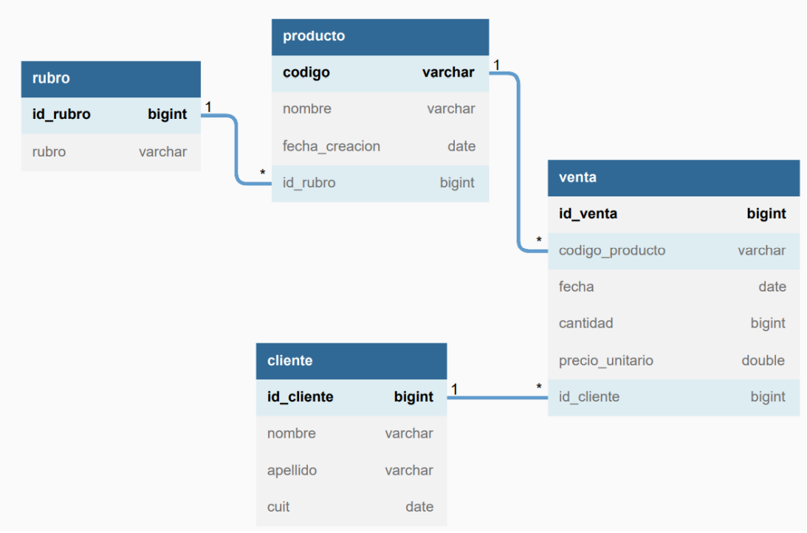
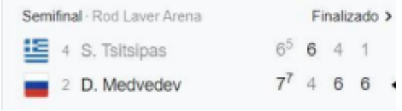

# TennisGame
Prueba tecnica Dux Software

## Parte 1: SQL
Dada la siguiente estructura de tablas:

Realizar las consultas SQL necesarias para obtener los siguientes datos:

- Todos los productos del rubro "librería", creados hoy.

SELECT p.nombre, p.fecha_creacion, r.rubro
FROM producto AS p
INNER JOIN rubro AS r
ON p.id_rubro= r.id_rubro
WHERE p.fecha_creacion = CAST(now() AS DATE) AND r.rubro = "librería";

- Monto total vendido por cliente (mostrar nombre del cliente y monto).

SELECT (SUM(v.precio_unitario * v.cantidad) ) monto_total_vendido, c.nombre cliente_nombre
FROM venta AS v
INNER JOIN cliente AS c
ON v.id_cliente = c.id_cliente
GROUP BY c.nombre;

- Cantidad de ventas por producto.

SELECT SUM(v.cantidad) cantidad_vendida, p.nombre producto_nombre
FROM venta AS v
INNER JOIN producto AS p
ON v.codigo_producto = p.codigo
GROUP BY p.nombre;

- Cantidad de productos comprados por cliente en el mes actual.

SELECT SUM(v.cantidad) cantidad_vendida, v.fecha, c.nombre
FROM venta AS v
INNER JOIN cliente AS c
ON v.id_cliente = c.id_cliente
WHERE year(v.fecha) = year(now()) and month(v.fecha) = month(now())
GROUP BY c.nombre;

- Ventas que tienen al menos un producto del rubro "bazar".

SELECT v.fecha, v.cantidad, v. precio_unitario, p.nombre producto_nombre, r.rubro
FROM venta AS v
INNER JOIN producto AS p
ON v.codigo_producto = p.codigo
INNER JOIN rubro AS r
ON r.id_rubro = p.id_rubro
HAVING r.rubro = "bazar";

- Rubros que no tienen ventas en los últimos 2 meses.

SELECT r.id_rubro, r.rubro, v.fecha fecha_facturacion
FROM rubro AS r
INNER JOIN producto AS p
ON r.id_rubro = p.id_rubro
INNER JOIN venta AS v
ON v.codigo_producto = p.codigo
group by r.id_rubro
having PERIOD_DIFF(EXTRACT(MONTH FROM NOW()), EXTRACT(MONTH FROM v.fecha)) <= -2 and !(PERIOD_DIFF(EXTRACT(MONTH FROM NOW()), EXTRACT(MONTH FROM v.fecha)) >= -2);

## * Se adjunta script dux.sql que crea, hace la carga inicial y contiene las consultas para ejecutar, en respuesta de la primer parte de la prueba.

## Parte 2: Java
Crear un programa que simule un partido de tenis, el mismo debe solicitar al usuario ingresar los datos
del partido (jugadores, nombre del torneo, etc) y con estos debe ejecutar punto por punto el transcurso
del partido hasta llegar a su fin.
El programa deberá tener en cuenta la puntuación y reglas utilizadas en este deporte.
### Funcionalidades
Antes de comenzar la simulación, el usuario podrá ingresar los siguientes datos:

• Nombres de los jugadores.

• Nombre del torneo.

• Definición de la cantidad de sets: al mejor de 3 o al mejor de 5.

• Probabilidad de que cada jugador gane el partido (tiene que ir del 1 al 100% e influir en el
resultado final).

El programa deberá simular punto por punto de forma automática, donde el ganador de cada uno será
determinado de forma aleatoria (teniendo en cuenta la probabilidad definida al principio), y los mismos
se tienen que visualizar por pantalla. Datos a mostrar:

• Ganador del punto.

• Resultado parcial del game.

• Al comenzar un game, mostrar el jugador que tiene el saque.

• Al finalizar cada SET, se mostrará el ganador y el resultado parcial del partido.

Una vez finalizado el partido:

• Imprimir el resultado en formato de partido de tenis.

• Imprimir el nombre del ganador y del torneo.

• Preguntar al usuario si quiere jugar la revancha, en caso de que la respuesta sea sí, simular
nuevamente.

### A considerar
- No se evaluará de forma estricta la interfaz, por lo que puede hacerse por consola.
- No es necesario que haya persistencia.
- El programa tiene que compilar y poder ejecutarse sin problemas.